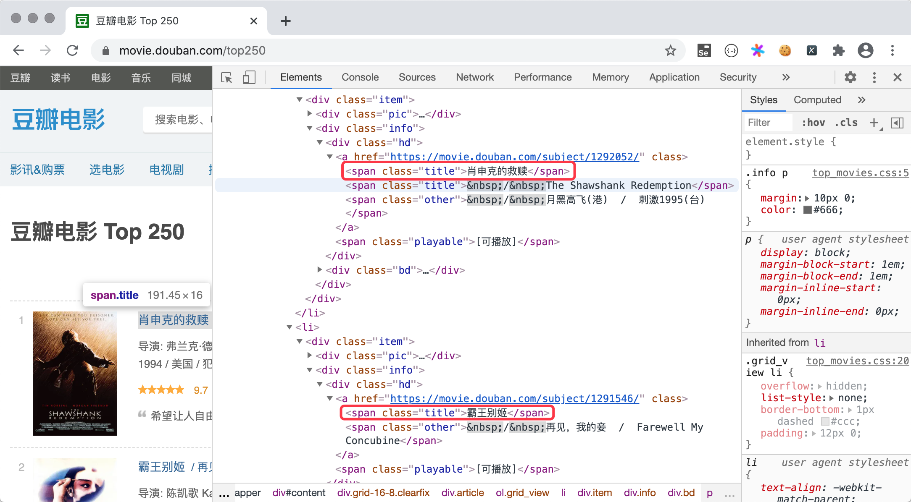

## 第030课：用Python获取网络数据

对于Python语言来说，一个较为擅长的领域就是网络数据采集，实现网络数据采集的程序通常称之为网络爬虫或蜘蛛程序。即便是在大数据时代，数据对于中小企业来说仍然是硬伤和短板，有些数据需要通过开放或付费的数据接口来获得，其他的行业数据则必须要通过网络数据采集的方式来获得。不管使用哪种方式获取网络数据资源，Python语言都是非常好的选择，因为Python的标准库和三方库都对获取网络数据提供了良好的支持。

### HTTP和requests库

要使用Python获取网络数据，我们可以先安装一个名为`requests` 的三方库，这个库我们在第24课中已经使用过了。按照官方网站的解释，`requests`是基于Python标准库进行了封装，简化了通过[HTTP](https://www.ruanyifeng.com/blog/2016/08/http.html)访问网络资源的操作。说到HTTP相信大家不会陌生，通常我们打开浏览器浏览网页时，我们就是使用了HTTP或[HTTPS](https://zhuanlan.zhihu.com/p/100591696)。HTTP是一个请求响应式的协议，当我们在浏览器中输入正确的[URL](https://developer.mozilla.org/zh-CN/docs/Learn/Common_questions/What_is_a_URL)（通常也称为网址）并按下回车（Enter），我们就向网络上的[Web服务器](https://developer.mozilla.org/zh-CN/docs/Learn/Common_questions/What_is_a_web_server)发送了一个HTTP请求，服务器在收到请求后会给我们一个HTTP响应，服务器给浏览器的数据就包含在这个响应中。我们可以使用浏览器提供的“开发者工具”或是“抓包工具”（如：Fiddler、Charles等）来了解HTTP请求和响应到底是什么样子的，如下图所示。


通过`requests`库，我们可以让程序向浏览器一样向Web服务器发起请求，并接收到服务器返回的响应，从响应中我们就可以提取出我们想要的数据。下面通过两个例子来演示如何获取网页代码和网络资源（如：图片），浏览器呈现给我们的网页是用[HTML](https://developer.mozilla.org/zh-CN/docs/Web/HTML)编写的，浏览器相当于是HTML的解释器环境，我们看到的网页中的内容都包含在HTML的标签中。在获取到HTML代码后，就可以从标签的属性或标签体中提取我们需要的内容。

获取搜狐网首页。

```Python
import requests

# requests的get函数会返回一个Response对象
resp = requests.get('https://www.sohu.com/')
if resp.status_code == 200:
    # 通过Response对象的text属性获取服务器返回的文本内容
    print(resp.text)
```

获取百度Logo并保存到名为`baidu.png`的本地文件中。首先在百度的首页上，右键点击百度Logo，并通过“复制图片地址”菜单获取图片的URL。

```Python
import requests

resp = requests.get('https://www.baidu.com/img/PCtm_d9c8750bed0b3c7d089fa7d55720d6cf.png')
with open('baidu.png', 'wb') as file:
    # 通过Response对象的content属性获取服务器返回的二进制内容
    file.write(resp.content)
```

> **说明**：关于`requests`库的详细使用方法，大家可以参考[官方文档](https://requests.readthedocs.io/zh_CN/latest/)的内容。

### 访问网络数据接口

国内外的很多网站都提供了开放数据接口，在开发商业项目时，如果有些事情我们自己无法解决，就可以借助这些开放的数据接口来处理。例如要根据用户或企业上传的资料进行实名认证或企业认证，我们就可以调用第三方提供的开放接口来识别用户或企业信息的真伪；例如要获取某个城市的天气信息，我们不可能直接从气象卫星拿到数据然后自己进行运算，只能通过第三方提供的数据接口来得到对应的天气信息。通常，提供有商业价值的数据的接口都是需要支付费用后才能访问的，在访问接口时还需要提供身份标识，便于服务器判断用户是不是付费用户以及进行费用扣除等相关操作。当然，还有些接口是可以免费使用的，但是必须先提供个人或者公司的信息才能访问，例如：[深圳市政府数据开放平台](https://opendata.sz.gov.cn/data/api/toApi)、[蜻蜓FM开放平台](https://open.qingting.fm/)等。如果查找自己需要的数据接口，可以访问[聚合数据](https://www.juhe.cn/)这类型的网站。

目前，我们访问的网络数据接口大多会返回JSON格式的数据，我们在第24课讲解序列化和反序列的时候，提到过JSON格式的字符串跟Python中的字典如何进行转换，并以[天行数据](https://www.tianapi.com/)为例讲解过网络数据接口访问的相关知识，这里我们就不再进行赘述了。

### 开发爬虫/蜘蛛程序

有的时候，我们需要的数据并不能通过开放数据接口来获得，但是可能在某些网页上能够获取到，这个时候就需要我们开发爬虫程序通过爬取页面来获得需要的内容。我们可以按照上面提供的方法，使用`requests`先获取到网页的HTML代码，我们可以将整个代码看成一个长字符串，这样我们就可以使用正则表达式的捕获组从字符串提取我们需要的内容。下面我们通过代码演示如何从[豆瓣电影](https://movie.douban.com/)获取排前250名的电影的名称。豆瓣电影Top250页面的结构和对应的代码如下图所示。



```Python
import random
import re
import time

import requests

for page in range(1, 11):
    resp = requests.get(
        # 请求https://movie.douban.com/top250时，start参数代表了从哪一部电影开始
        url=f'https://movie.douban.com/top250?start={(page - 1) * 25}',
        # 如果不设置HTTP请求头中的User-Agent，豆瓣会检测出爬虫程序而阻止我们的请求
        # User-Agent可以设置为浏览器的标识（可以在浏览器的开发者工具查看HTTP请求头找到）
        # 由于豆瓣网允许百度爬虫获取它的数据，因此直接将我们的爬虫伪装成百度的爬虫
        headers={'User-Agent': 'BaiduSpider'}
    )
    # 创建正则表达式对象，通过捕获组捕获span标签中的电影标题
    pattern = re.compile(r'\<span class="title"\>([^&]*?)\<\/span\>')
    # 通过正则表达式获取class属性为title且标签内容不以&符号开头的span标签
    results = pattern.findall(resp.text)
    # 循环变量列表中所有的电影标题
    for result in results:
        print(result)
    # 随机休眠1-3秒，避免获取页面过于频繁
    time.sleep(random.randint(1, 3))
```

编写爬虫程序比较重要的一点就是让爬虫程序隐匿自己的身份，因为一般的网站都比较反感爬虫。隐匿身份除了像上面的代码中修改`User-Agent`之外，还可以使用**商业IP代理**（如：[蘑菇代理](http://www.moguproxy.com/)、[芝麻代理](http://www.zhimaruanjian.com/)等），让被爬取的网站无法得知爬虫程序的真实IP地址，也就无法通过IP地址对爬虫程序进行封禁。当然，爬虫本身也是一个处于灰色地带的东西，没有谁说它是违法的，但也没有谁说它是合法的，本着**法不禁止即为许可**的精神，我们可以根据自己工作的需要去编写爬虫程序，但是如果被爬取的网站能够**举证你的爬虫程序有破坏动产的行为**，那么在打官司的时候，基本上是要败诉的，这一点需要注意。

另外，用编写正则表达式的方式从网页中提取内容虽然可行，但是写出一个能够满足需求的正则表达式本身也不是件容易的事情，这一点对于新手来说尤为明显。在下一节课中，我们将会为大家介绍另外两种从页面中提取数据的方法，虽然从性能上来讲，它们可能不如正则表达式，但是却降低了编码的复杂性，相信大家会喜欢上它们的。

###  简单的总结

Python语言能做的事情真的很多，就获取网络数据这一项而言，Python几乎是一枝独秀的，大量的企业和个人都会使用Python从网络上获取自己需要的数据，相信这一点在现在或者将来也会是你工作中的一部分。

# 作者介绍

哔哩哔哩搜索“**Luckly年轻人** 主要发布文章包括，flutter，Vue，go，python，等技术，以及每月的读书笔记

公众号：“萌小肆聊编程”

自建博客：[https://luckly.work/](https://luckly.work/)

哔哩哔哩：[https://space.bilibili.com/480883651](https://space.bilibili.com/480883651)

CSDN:[https://blog.csdn.net/qq_39132095](https://blog.csdn.net/qq_39132095?spm=1001.2101.3001.5343)

知乎：[https://www.zhihu.com/people/yimi-yang-guang-96-65](https://www.zhihu.com/people/yimi-yang-guang-96-65)

简书：[https://www.jianshu.com/u/0c43689713e9](https://www.jianshu.com/u/0c43689713e9)

掘金：[https://juejin.cn/user/3843548384077192](https://juejin.cn/user/3843548384077192)

GitHub：[https://github.com/ITmxs](https://github.com/ITmxs)

微信：xjg13690